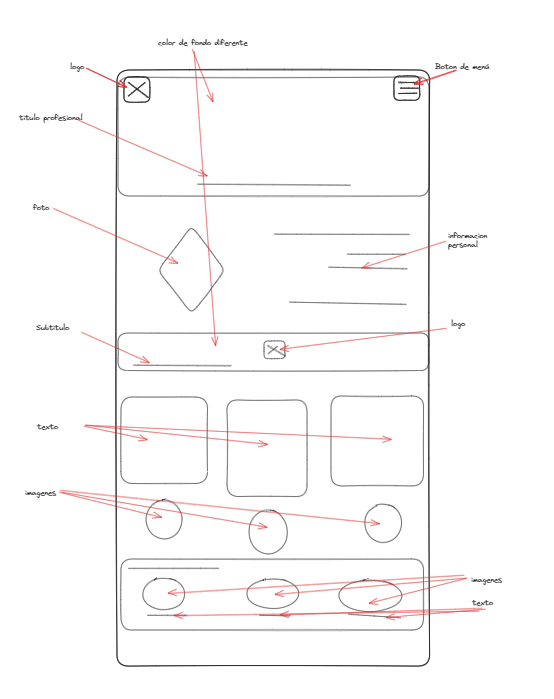
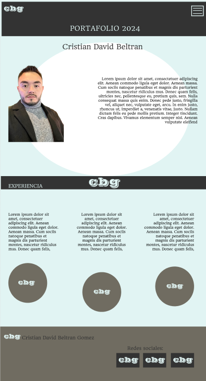

# entregas
<h1> Portafolio </h1>

 Este es un proyecto de iniciacion al diseño y desarrollo de una pagina web. En este trabajo se evidencia como se inicia desde un wireframe hasta la terminacion ya codificada de una pagina web.

 El portafolio es una pagina web con el perfil profesional actualizado al año 2024 de Cristian David Beltran Gomez estudiante de Bootcamp desarrollo web dictado por la docente y profesional Luisa Castaño. 

 El proyecto se realizo en el siguiente orden:
    1. Wireframe: Se realizo una idea inicial del proyecto con un plano que especificaba las ideas basicas y principales del proyecto.
    2. Mockup: la realizacion del proyecto ya conteniendo el diseño y una idea totalmente plasmada pero sin ningun tipo de funcionalidad todavia.
    3. Proyecto terminado (html y css) : la aplicacion de codigos tanto estructuralmente como en diseño y estilos para la terminacion del mismo.
    4. Se añaden tranformaciones y animaciones, adicionalmente diferentes ejemplos de posicion de elementos tanto flex como grid

 Autoria Cristian David Beltran Gomez 

